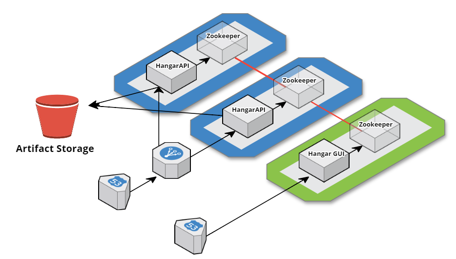

# hangar
After many, many years of dealing with expensive, monolithic artifact management solutions - I thought I'd give it a go myself. Can't be that hard, right?

https://xkcd.com/927/

# Architecture

The idea is that this system is as stateless and distributed as possible, so super-fault tolerant. The artifacts are stored in S3 and the index in Zookeeper. Hangar API deals with the RESTful requests from maven/gradle and Hangar-GUI gives you a search/browse functionality feeding from the index.

Below is a typical installation of Hangar...

# Features

So far...

* (Java) Allow S3-backed Storage
* (Java) Create zookeeper-based index
* (Java) Allow downloading of latest snapshot
* (Java) Allow upload of releases
* (Java) Will proxy artifacts from remote repositories, saving copy to the storage layer as it passes them on.
* (Java) In-memory index for quick identification of artifacts
* (Java) Will re-index from local storage using streams (super quick)
* (Java) Will accept snapshot artifacts to upload. 
* (Java) Allows separate storage for snapshots, releases and proxy data.

To go...

* (Java) Retention policies on a repo-by-repo basis.

# Run Me

1. Clone the repo.
2. Run `mvn package` at the root of the project.
3. Run `docker build -t hangar:latest -f ./etc/docker/app/Dockerfile .` from the root of the project
4. Run `docker run -p 8080:8080 hangar:latest`

You should see the following...

	INFO  [2016-05-07 17:26:56,825] org.eclipse.jetty.util.log: Logging initialized @674ms
	INFO  [2016-05-07 17:26:56,910] com.spedge.hangar.storage.Storage: 2 Artifacts Indexed under /data/java-snapshots
	INFO  [2016-05-07 17:26:56,912] com.spedge.hangar.storage.Storage: 0 Artifacts Indexed under /data/java-releases
	INFO  [2016-05-07 17:26:56,960] com.spedge.hangar.storage.Storage: 293 Artifacts Indexed under /data/java-proxy
	INFO  [2016-05-07 17:26:56,963] io.dropwizard.server.ServerFactory: Starting hangar
	INFO  [2016-05-07 17:26:56,967] io.dropwizard.server.DefaultServerFactory: Registering jersey handler with root path prefix: /
	INFO  [2016-05-07 17:26:56,976] io.dropwizard.server.DefaultServerFactory: Registering admin handler with root path prefix: /
	INFO  [2016-05-07 17:26:56,996] org.eclipse.jetty.setuid.SetUIDListener: Opened application@4bf3798b{HTTP/1.1}{0.0.0.0:8080}
	INFO  [2016-05-07 17:26:56,996] org.eclipse.jetty.setuid.SetUIDListener: Opened admin@58670130{HTTP/1.1}{0.0.0.0:8081}
	INFO  [2016-05-07 17:26:56,997] org.eclipse.jetty.server.Server: jetty-9.2.13.v20150730
	INFO  [2016-05-07 17:26:57,310] io.dropwizard.jersey.DropwizardResourceConfig: The following paths were found for the configured resources:

    GET     /java/snapshots/{group : .+}/{artifact : .+}/{version : (?i)[\d\.]+-SNAPSHOT}/{filename : [^/]+} (com.spedge.hangar.repo.java.JavaSnapshotRepository)
    PUT     /java/snapshots/{group : .+}/{artifact : .+}/{version : (?i)[\d\.]+-SNAPSHOT}/{filename : [^/]+} (com.spedge.hangar.repo.java.JavaSnapshotRepository)
    GET     /java/{dummy2 : (snapshots)?}{dummy3 : (/)+}{group : .+}{dummy4 : (/)+}{artifact : .+}{dummy5 : (/)?}{version : (?i)[\d\.]*(-SNAPSHOT)?}/maven-metadata.xml{type : (\.)?(\w)*} (com.spedge.hangar.repo.java.JavaSnapshotRepository)
    PUT     /java/{dummy2 : (snapshots)?}{dummy3 : (/)+}{group : .+}{dummy4 : (/)+}{artifact : .+}{dummy5 : (/)?}{version : (?i)[\d\.]*(-SNAPSHOT)?}/maven-metadata.xml{type : (\.)?(\w)*} (com.spedge.hangar.repo.java.JavaSnapshotRepository)
    GET     /java/{group : .+}/{artifact : .+}/{version : .+}/{filename : [^/]+} (com.spedge.hangar.repo.java.JavaDownloadRepository)
    PUT     /test/headers (com.spedge.hangar.requests.TestRequest)

	INFO  [2016-05-07 17:26:57,311] org.eclipse.jetty.server.handler.ContextHandler: Started i.d.j.MutableServletContextHandler@59546cfe{/,null,AVAILABLE}
	INFO  [2016-05-07 17:26:57,315] io.dropwizard.setup.AdminEnvironment: tasks = 

    POST    /tasks/log-level (io.dropwizard.servlets.tasks.LogConfigurationTask)
    POST    /tasks/gc (io.dropwizard.servlets.tasks.GarbageCollectionTask)

	INFO  [2016-05-07 17:26:57,318] org.eclipse.jetty.server.handler.ContextHandler: Started i.d.j.MutableServletContextHandler@5ce4369b{/,null,AVAILABLE}
	INFO  [2016-05-07 17:26:57,330] org.eclipse.jetty.server.ServerConnector: Started application@4bf3798b{HTTP/1.1}{0.0.0.0:8080}
	INFO  [2016-05-07 17:26:57,333] org.eclipse.jetty.server.ServerConnector: Started admin@58670130{HTTP/1.1}{0.0.0.0:8081}
	INFO  [2016-05-07 17:26:57,333] org.eclipse.jetty.server.Server: Started @1183ms
